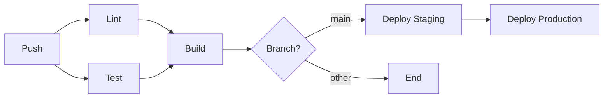

# Lab 904: Workflow Documentation

## LEARNING CONCEPT

Documenting GitHub Actions workflows.

## EXERCISE

1. Document workflows
2. Create workflow guides
3. Maintain documentation

## SOLUTION

### Workflow Header Comments

```yaml
# =============================================================================
# CI Workflow
# =============================================================================
#
# This workflow runs on every push and pull request to main.
#
# Jobs:
#   - lint: Code linting with ESLint
#   - test: Unit tests with Jest
#   - build: Production build
#
# Required secrets:
#   - None
#
# Required variables:
#   - None
#
# =============================================================================

name: CI
```

### Job Documentation

```yaml
jobs:
  # -------------------------------------------------------------------------
  # Lint Job
  # -------------------------------------------------------------------------
  # Runs ESLint to check code quality and style.
  # Fails if any errors are found.
  # -------------------------------------------------------------------------
  lint:
    runs-on: ubuntu-latest
    steps:
      - uses: actions/checkout@v4
      - run: npm run lint
```

### Step Documentation

```yaml
steps:
  # Checkout the repository code
  - name: Checkout code
    uses: actions/checkout@v4
    
  # Setup Node.js with caching for faster installs
  - name: Setup Node.js
    uses: actions/setup-node@v4
    with:
      node-version: '20'
      cache: 'npm'
```

### README Documentation

```markdown
# CI/CD Workflows

## Overview

This repository uses GitHub Actions for continuous integration and deployment.

## Workflows

### CI (`ci.yml`)

Runs on every push and pull request.

**Jobs:**
- `lint` - Code linting
- `test` - Unit tests
- `build` - Production build

### Deploy (`deploy.yml`)

Deploys to production on push to main.

**Required secrets:**
- `DEPLOY_TOKEN` - Deployment authentication token

**Environments:**
- `staging` - Staging environment
- `production` - Production environment (requires approval)

## Local Development

### Running workflows locally

```bash
# Install act
brew install act

# Run CI workflow
act push
```

## Troubleshooting

### Common Issues

1. **Build fails with "Module not found"**
   - Run `npm ci` to reinstall dependencies

2. **Tests timeout**
   - Check for async operations not completing
```

### Workflow Inputs Documentation

```yaml
on:
  workflow_dispatch:
    inputs:
      environment:
        description: 'Target environment for deployment'
        required: true
        type: choice
        options:
          - staging
          - production
        default: staging
        
      dry-run:
        description: 'Run without making changes'
        required: false
        type: boolean
        default: false
```

### Output Documentation

```yaml
jobs:
  build:
    runs-on: ubuntu-latest
    outputs:
      # The name of the uploaded artifact
      artifact-name: ${{ steps.upload.outputs.artifact-name }}
      # The version number from package.json
      version: ${{ steps.version.outputs.version }}
```

### Step Summary

```yaml
steps:
  - name: Generate summary
    run: |
      echo "## Build Summary" >> $GITHUB_STEP_SUMMARY
      echo "" >> $GITHUB_STEP_SUMMARY
      echo "### Configuration" >> $GITHUB_STEP_SUMMARY
      echo "| Setting | Value |" >> $GITHUB_STEP_SUMMARY
      echo "|---------|-------|" >> $GITHUB_STEP_SUMMARY
      echo "| Node.js | 20 |" >> $GITHUB_STEP_SUMMARY
      echo "| Environment | ${{ inputs.environment }} |" >> $GITHUB_STEP_SUMMARY
      echo "" >> $GITHUB_STEP_SUMMARY
      echo "### Results" >> $GITHUB_STEP_SUMMARY
      echo "- ✅ Lint passed" >> $GITHUB_STEP_SUMMARY
      echo "- ✅ Tests passed" >> $GITHUB_STEP_SUMMARY
      echo "- ✅ Build successful" >> $GITHUB_STEP_SUMMARY
```

### Changelog

```markdown
# Workflow Changelog

## [2024-01-15]
### Changed
- Updated Node.js to version 20
- Added caching for npm dependencies

## [2024-01-10]
### Added
- New deploy workflow with environment support
- Required reviewers for production

## [2024-01-05]
### Fixed
- Fixed test timeout issues
```

### Architecture Diagram

```markdown
## Workflow Architecture


```

### Complete Documentation Template

```yaml
# =============================================================================
# Workflow: Deploy
# File: .github/workflows/deploy.yml
# =============================================================================
#
# Description:
#   Deploys the application to staging and production environments.
#
# Triggers:
#   - Push to main branch
#   - Manual dispatch
#
# Jobs:
#   1. build - Builds the application
#   2. deploy-staging - Deploys to staging
#   3. deploy-production - Deploys to production (requires approval)
#
# Required Secrets:
#   - DEPLOY_TOKEN: Authentication token for deployment
#
# Required Variables:
#   - STAGING_URL: Staging environment URL
#   - PRODUCTION_URL: Production environment URL
#
# Environments:
#   - staging: No protection rules
#   - production: Requires 2 reviewers
#
# Usage:
#   # Automatic deployment on push to main
#   git push origin main
#
#   # Manual deployment
#   gh workflow run deploy.yml -f environment=staging
#
# =============================================================================

name: Deploy
```

### Best Practices

```
✅ Document at workflow level
✅ Explain required secrets
✅ Document inputs/outputs
✅ Use step summaries
✅ Maintain changelog
```

