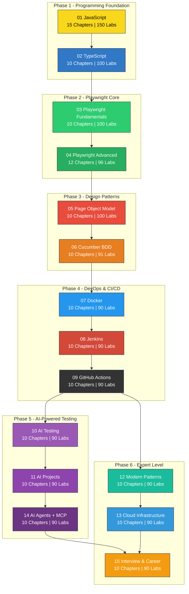
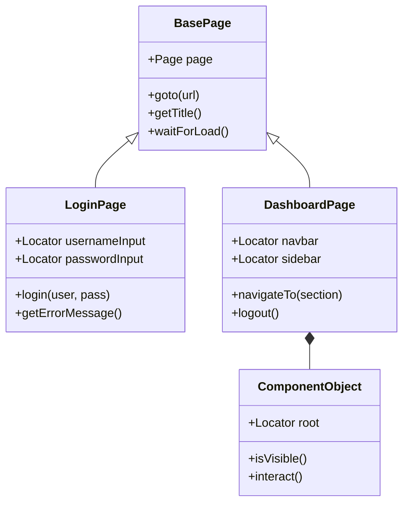
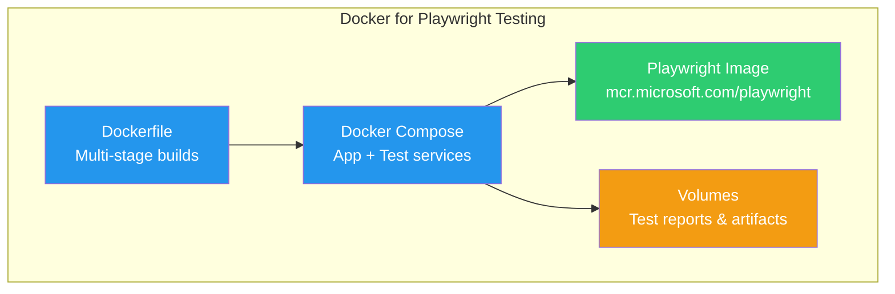
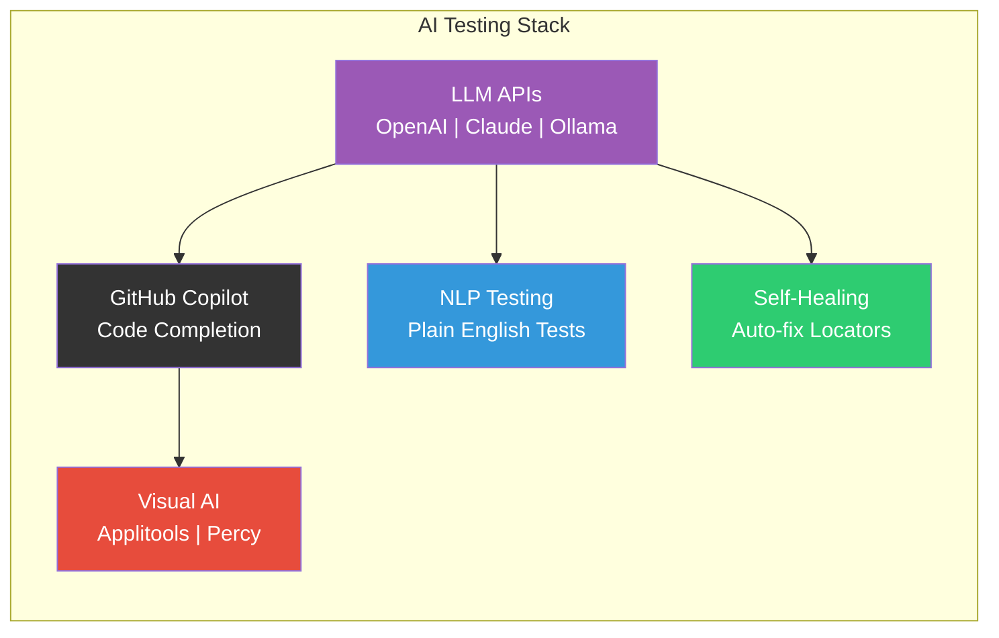
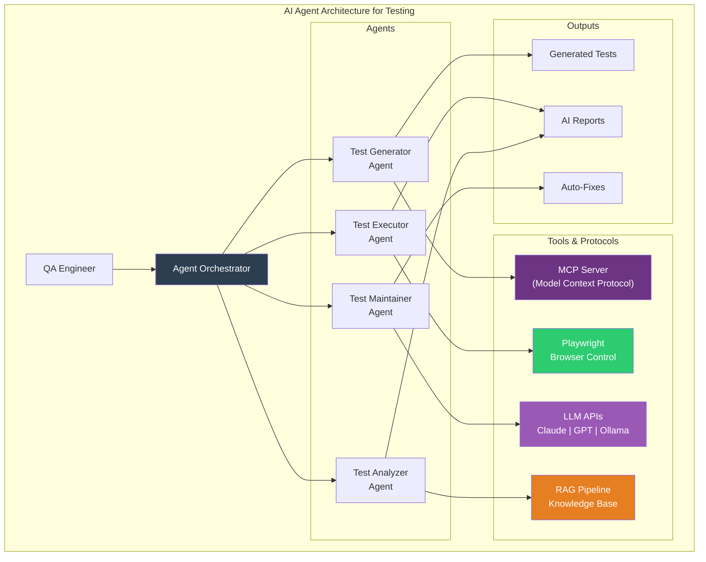
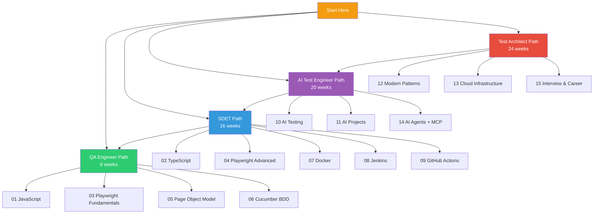
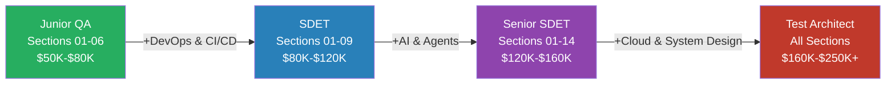
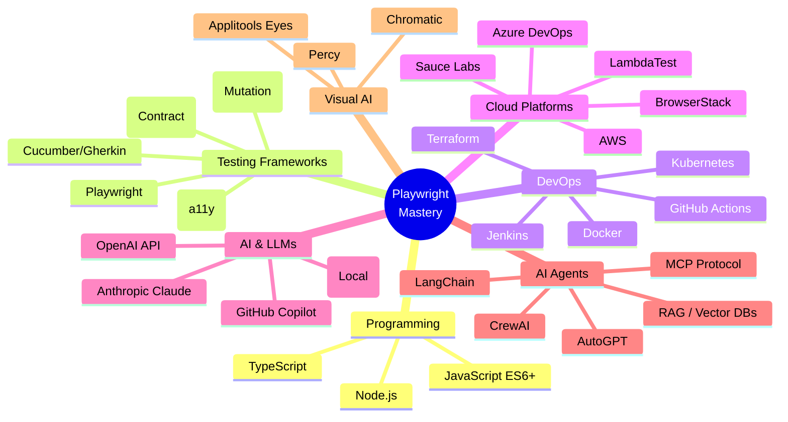

<p align="center">
  
</p>

<h1 align="center">90-Day Playwright Mastery Roadmap</h1>
<h3 align="center">JavaScript | TypeScript | AI Agents | MCP | CLI — For QA & SDET Engineers</h3>

<p align="center">
  <a href="#-quick-start"></a>
  <a href="#-90-day-roadmap"></a>
  <a href="#-ai-agents--mcp"></a>
</p>

<p align="center">
  
  
  
  
  
  
</p>

<p align="center">
  <strong>The most comprehensive Playwright + AI curriculum for QA/SDET professionals.</strong><br/>
  From zero JavaScript knowledge to building autonomous AI testing agents with MCP protocol — in 90 days.
</p>

---

## Table of Contents

- [Why This Roadmap](#-why-this-roadmap)
- [90-Day Roadmap](#-90-day-roadmap)
- [Architecture Overview](#-architecture-overview)
- [Repository Structure](#-repository-structure)
- [Section Deep Dive](#-section-deep-dive)
- [AI Agents & MCP](#-ai-agents--mcp)
- [CLI & Tooling](#-cli--tooling)
- [Learning Paths](#-learning-paths)
- [Career Progression](#-career-progression)
- [Quick Start](#-quick-start)
- [Lab Format](#-lab-format)
- [Quizzes & Cheatsheets](#-quizzes--cheatsheets)
- [Tools & Technologies](#-tools--technologies)
- [Contributing](#-contributing)

---

## Why This Roadmap

The QA/SDET landscape in 2026 demands more than just writing test scripts. You need:

- **AI-powered test generation** using LLMs (OpenAI, Anthropic Claude, Ollama)
- **Autonomous AI agents** that write, execute, and maintain tests
- **MCP (Model Context Protocol)** integration for tool-augmented AI workflows
- **CLI-first automation** for CI/CD pipelines and developer experience
- **Cloud-native testing** across AWS, Azure, Kubernetes, and serverless

This roadmap covers it all — **1,447 hands-on labs** progressing from JavaScript fundamentals to building production-ready AI testing agents.

---

## 90-Day Roadmap

```mermaid
gantt
    title 90-Day Playwright + AI Mastery Roadmap
    dateFormat  X
    axisFormat Day %s
    
    section Phase 1: Foundation
    JavaScript Fundamentals (150 labs)       :a1, 0, 15
    TypeScript Mastery (100 labs)            :a2, after a1, 10

    section Phase 2: Playwright Core
    Playwright Fundamentals (100 labs)       :b1, after a2, 10
    Playwright Advanced (96 labs)            :b2, after b1, 12

    section Phase 3: Patterns & BDD
    Page Object Model (100 labs)             :c1, after b2, 8
    Cucumber BDD (91 labs)                   :c2, after c1, 7

    section Phase 4: DevOps & CI/CD
    Docker (90 labs)                         :d1, after c2, 5
    Jenkins CI/CD (90 labs)                  :d2, after d1, 5
    GitHub Actions (90 labs)                 :d3, after d2, 5

    section Phase 5: AI & Agents
    AI Testing (90 labs)                     :e1, after d3, 5
    AI Real-World Projects (90 labs)         :e2, after e1, 5
    AI Agents + MCP (90 labs)               :e3, after e2, 5

    section Phase 6: Expert
    Modern Patterns (90 labs)                :f1, after d3, 5
    Cloud Infrastructure (90 labs)           :f2, after f1, 5
    Interview & Career (90 labs)             :f3, after e3, 3
```



### Daily Breakdown

| Day | Phase | Section | Focus | Labs |
|-----|-------|---------|-------|------|
| 1-15 | Foundation | 01 JavaScript | Variables, Functions, Async, OOP | 001-150 |
| 16-25 | Foundation | 02 TypeScript | Types, Interfaces, Generics | 151-250 |
| 26-35 | Playwright | 03 Fundamentals | Locators, Actions, Assertions, Config | 251-350 |
| 36-47 | Playwright | 04 Advanced | API, Auth, Visual, Performance, a11y | 351-446 |
| 48-55 | Patterns | 05 POM | Page Classes, Fixtures, Data Management | 447-546 |
| 56-62 | Patterns | 06 BDD | Gherkin, Step Defs, Hooks, Tags | 547-637 |
| 63-67 | DevOps | 07 Docker | Dockerfile, Compose, Multi-stage | 638-727 |
| 68-72 | DevOps | 08 Jenkins | Pipelines, Parallel, Shared Libs | 728-817 |
| 73-77 | DevOps | 09 GitHub Actions | Workflows, Matrix, Caching | 818-907 |
| 78-82 | AI | 10 AI Testing | Copilot, LLMs, Visual AI | 908-997 |
| 83-87 | AI | 11 AI Projects | CLI Tools, Self-Healing, Bots | 998-1087 |
| 88-90 | AI | 14 AI Agents + MCP | LangChain, CrewAI, RAG, MCP | 1268-1357 |

---

## Architecture Overview



---

## Repository Structure

```
LearningPlaywrightTS/
|
|-- README.md                          # You are here
|-- CURRICULUM.md                      # Detailed curriculum with all chapters
|-- QUICK_START.md                     # 30-minute setup guide
|
|-- 01_JavaScript/                     # Labs 001-150 | 15 Chapters
|   |-- chapter_01_variables_datatypes/
|   |   |-- chapter_01_notes.md
|   |   |-- lab001_declaring_variables.js
|   |   |-- lab002_data_types.js
|   |   +-- ... (10 labs per chapter)
|   |-- chapter_02_operators/
|   |-- chapter_03_control_flow/
|   |-- chapter_04_loops/
|   |-- chapter_05_functions/
|   |-- chapter_06_arrays/
|   |-- chapter_07_objects/
|   |-- chapter_08_strings/
|   |-- chapter_09_dom_manipulation/
|   |-- chapter_10_events/
|   |-- chapter_11_async_callbacks_promises/
|   |-- chapter_12_async_await/
|   |-- chapter_13_error_handling/
|   |-- chapter_14_es6_features/
|   +-- chapter_15_classes_oop/
|
|-- 02_TypeScript/                     # Labs 151-250 | 10 Chapters
|   |-- chapter_01_introduction_setup/
|   |-- chapter_02_basic_types/
|   |-- chapter_03_type_annotations/
|   |-- chapter_04_interfaces/
|   |-- chapter_05_classes/
|   |-- chapter_06_generics/
|   |-- chapter_07_union_intersection_types/
|   |-- chapter_08_type_guards/
|   |-- chapter_09_enums/
|   +-- chapter_10_modules/
|
|-- 03_Playwright_Fundamentals/        # Labs 251-350 | 10 Chapters
|   |-- chapter_01_introduction_setup/
|   |-- chapter_02_locators/
|   |-- chapter_03_actions/
|   |-- chapter_04_assertions/
|   |-- chapter_05_navigation/
|   |-- chapter_06_waits/
|   |-- chapter_07_screenshots_videos/
|   |-- chapter_08_debugging/
|   |-- chapter_09_configuration/
|   +-- chapter_10_test_organization/
|
|-- 04_Playwright_Advanced/            # Labs 351-446 | 12 Chapters
|   |-- chapter_01_api_testing/
|   |-- chapter_02_network_mocking/
|   |-- chapter_03_authentication/
|   |-- chapter_04_file_handling/
|   |-- chapter_05_iframes_windows/
|   |-- chapter_06_mobile_emulation/
|   |-- chapter_07_visual_testing/
|   |-- chapter_08_performance/
|   |-- chapter_09_accessibility/
|   |-- chapter_10_component_testing/
|   |-- chapter_11_parallel_sharding/
|   +-- chapter_12_custom_reporters/
|
|-- 05_Page_Object_Model/              # Labs 447-546 | 10 Chapters
|   |-- chapter_01_pom_introduction/
|   |-- chapter_02_page_classes/
|   |-- chapter_03_locator_strategies/
|   |-- chapter_04_action_methods/
|   |-- chapter_05_assertions_in_pom/
|   |-- chapter_06_component_objects/
|   |-- chapter_07_fixtures_with_pom/
|   |-- chapter_08_data_management/
|   |-- chapter_09_advanced_patterns/
|   +-- chapter_10_best_practices/
|
|-- 06_Cucumber_BDD_Playwright/        # Labs 547-637 | 10 Chapters
|   |-- chapter_01_bdd_introduction/
|   |-- chapter_02_cucumber_setup/
|   |-- chapter_03_step_definitions/
|   |-- chapter_04_hooks/
|   |-- chapter_05_data_tables/
|   |-- chapter_06_scenario_outline/
|   |-- chapter_07_tags_filtering/
|   |-- chapter_08_reports/
|   |-- chapter_09_playwright_integration/
|   +-- chapter_10_best_practices/
|
|-- 07_Docker/                         # Labs 638-727 | 10 Chapters
|   |-- chapter_01_docker_basics/
|   |-- chapter_02_dockerfile/
|   |-- chapter_03_docker_compose/
|   |-- chapter_04_playwright_docker/
|   |-- chapter_05_volumes_networking/
|   |-- chapter_06_environment_variables/
|   |-- chapter_07_multi_stage_builds/
|   |-- chapter_08_ci_integration/
|   |-- chapter_09_debugging/
|   +-- chapter_10_best_practices/
|
|-- 08_Jenkins/                        # Labs 728-817 | 10 Chapters
|   |-- chapter_01_jenkins_basics/
|   |-- chapter_02_pipeline_basics/
|   |-- chapter_03_playwright_jenkins/
|   |-- chapter_04_credentials/
|   |-- chapter_05_parallel_execution/
|   |-- chapter_06_artifacts_reports/
|   |-- chapter_07_notifications/
|   |-- chapter_08_shared_libraries/
|   |-- chapter_09_docker_agents/
|   +-- chapter_10_best_practices/
|
|-- 09_GitHub_Actions/                 # Labs 818-907 | 10 Chapters
|   |-- chapter_01_workflow_basics/
|   |-- chapter_02_playwright_actions/
|   |-- chapter_03_matrix_builds/
|   |-- chapter_04_secrets_variables/
|   |-- chapter_05_caching/
|   |-- chapter_06_artifacts/
|   |-- chapter_07_reusable_workflows/
|   |-- chapter_08_composite_actions/
|   |-- chapter_09_deployment/
|   +-- chapter_10_best_practices/
|
|-- 10_AI_Testing/                     # Labs 908-997 | 10 Chapters
|   |-- chapter_01_ai_fundamentals/
|   |-- chapter_02_github_copilot/
|   |-- chapter_03_ai_test_generation/
|   |-- chapter_04_ai_locators/
|   |-- chapter_05_nlp_testing/
|   |-- chapter_06_visual_ai/
|   |-- chapter_07_ai_maintenance/
|   |-- chapter_08_ai_analysis/
|   |-- chapter_09_llm_integration/
|   +-- chapter_10_ai_best_practices/
|
|-- 11_AI_Projects/                    # Labs 998-1087 | 10 Chapters
|   |-- chapter_01_ai_test_generator_cli/
|   |-- chapter_02_self_healing_framework/
|   |-- chapter_03_ai_test_reporter/
|   |-- chapter_04_conversational_test_bot/
|   |-- chapter_05_visual_regression_ai/
|   |-- chapter_06_test_data_factory/
|   |-- chapter_07_smart_test_selector/
|   |-- chapter_08_ai_code_review_bot/
|   |-- chapter_09_e2e_test_copilot/
|   +-- chapter_10_ai_testing_platform/
|
|-- 12_Modern_Patterns/                # Labs 1088-1177 | 10 Chapters
|   |-- chapter_01_contract_testing/
|   |-- chapter_02_graphql_testing/
|   |-- chapter_03_websocket_testing/
|   |-- chapter_04_pwa_testing/
|   |-- chapter_05_accessibility_testing/
|   |-- chapter_06_performance_testing/
|   |-- chapter_07_security_testing/
|   |-- chapter_08_mutation_testing/
|   |-- chapter_09_chaos_testing/
|   +-- chapter_10_web3_blockchain/
|
|-- 13_Cloud_Infrastructure/           # Labs 1178-1267 | 10 Chapters
|   |-- chapter_01_aws_testing/
|   |-- chapter_02_azure_devops/
|   |-- chapter_03_kubernetes_testing/
|   |-- chapter_04_terraform/
|   |-- chapter_05_cloud_test_grids/
|   |-- chapter_06_monitoring_observability/
|   |-- chapter_07_database_testing/
|   |-- chapter_08_message_queue_testing/
|   |-- chapter_09_microservices_testing/
|   +-- chapter_10_serverless_testing/
|
|-- 14_AI_Agents/                      # Labs 1268-1357 | 10 Chapters
|   |-- chapter_01_ai_agents_intro/
|   |-- chapter_02_langchain_testing/
|   |-- chapter_03_autogpt_crewai/
|   |-- chapter_04_multi_agent_systems/
|   |-- chapter_05_autonomous_test_gen/
|   |-- chapter_06_agent_orchestration/
|   |-- chapter_07_rag_testing/
|   |-- chapter_08_fine_tuning_models/
|   |-- chapter_09_mcp_protocol/
|   +-- chapter_10_custom_ai_agents/
|
|-- 15_Interview_Career/               # Labs 1358-1447 | 10 Chapters
|   |-- chapter_01_playwright_fundamentals_review/
|   |-- chapter_02_advanced_playwright_review/
|   |-- chapter_03_javascript_interview/
|   |-- chapter_04_typescript_interview/
|   |-- chapter_05_testing_concepts_interview/
|   |-- chapter_06_system_design_interview/
|   |-- chapter_07_behavioral_interview/
|   |-- chapter_08_portfolio_projects/
|   |-- chapter_09_resume_linkedin/
|   +-- chapter_10_mock_interviews/
|
|-- cheatsheets/                       # 6 Quick Reference Guides
|   |-- cheatsheet_01_javascript.md
|   |-- cheatsheet_02_typescript.md
|   |-- cheatsheet_03_playwright.md
|   |-- cheatsheet_07_docker.md
|   |-- cheatsheet_09_github_actions.md
|   +-- cheatsheet_10_ai_testing.md
|
+-- quizzes/                           # 15 Self-Assessment Quizzes
    |-- quiz_01_javascript.md
    |-- quiz_02_typescript.md
    |-- ... (one per section)
    +-- quiz_15_interview_career.md
```

---

## Section Deep Dive

### Phase 1: Programming Foundation (Days 1-25)

#### Section 01 — JavaScript Fundamentals

> **15 Chapters | 150 Labs | 15 Chapter Notes**

| Ch | Topic | Labs | What You Learn |
|:--:|-------|:----:|----------------|
| 01 | Variables & Data Types | 10 | `let`, `const`, `var`, primitives, type coercion |
| 02 | Operators | 10 | Arithmetic, comparison, logical, ternary, nullish |
| 03 | Control Flow | 10 | `if/else`, `switch`, conditional expressions |
| 04 | Loops | 10 | `for`, `while`, `do-while`, `for...of`, `for...in` |
| 05 | Functions | 10 | Declaration, expression, arrow, closures, IIFE |
| 06 | Arrays | 10 | `map`, `filter`, `reduce`, destructuring, spread |
| 07 | Objects | 10 | Properties, methods, `this`, prototypes, `Object.*` |
| 08 | Strings | 10 | Template literals, regex, `String` methods |
| 09 | DOM Manipulation | 10 | Selectors, createElement, classList, attributes |
| 10 | Events | 10 | Event handling, bubbling, capturing, delegation |
| 11 | Async & Promises | 10 | Callbacks, Promise chaining, `Promise.all` |
| 12 | Async/Await | 10 | Async functions, error handling, parallelism |
| 13 | Error Handling | 10 | `try/catch`, custom errors, debugging strategies |
| 14 | ES6+ Features | 10 | Modules, symbols, iterators, generators, Proxy |
| 15 | Classes & OOP | 10 | Classes, inheritance, encapsulation, polymorphism |

**Mini-Project:** Build a Test Utility Library

---

#### Section 02 — TypeScript

> **10 Chapters | 100 Labs | 10 Chapter Notes**

| Ch | Topic | Labs | What You Learn |
|:--:|-------|:----:|----------------|
| 01 | Introduction & Setup | 10 | Installation, `tsconfig.json`, compilation, ts-node |
| 02 | Basic Types | 10 | `string`, `number`, `boolean`, `any`, `unknown`, `never` |
| 03 | Type Annotations | 10 | Variable types, function params, return types |
| 04 | Interfaces | 10 | Object shapes, optional props, `readonly`, extending |
| 05 | Classes | 10 | Access modifiers, `abstract`, `implements` |
| 06 | Generics | 10 | Generic functions, classes, constraints, utility types |
| 07 | Union & Intersection | 10 | Type combinations, discriminated unions, narrowing |
| 08 | Type Guards | 10 | `typeof`, `instanceof`, custom type predicates |
| 09 | Enums | 10 | Numeric, string, const enums, reverse mapping |
| 10 | Modules | 10 | Import/export, namespaces, declaration files |

**Mini-Project:** Type-Safe Test Framework

---

### Phase 2: Playwright Core (Days 26-47)

#### Section 03 — Playwright Fundamentals

> **10 Chapters | 100 Labs | 10 Chapter Notes**


| Ch | Topic | Labs | What You Learn |
|:--:|-------|:----:|----------------|
| 01 | Introduction & Setup | 10 | Install Playwright, project structure, first test |
| 02 | Locators | 10 | CSS, XPath, role-based, text, `data-testid`, chaining |
| 03 | Actions | 10 | `click`, `fill`, `selectOption`, `hover`, `dragTo`, keyboard |
| 04 | Assertions | 10 | `expect`, `toBeVisible`, `toHaveText`, soft assertions |
| 05 | Navigation | 10 | `goto`, `reload`, `goBack`, `goForward`, `waitForURL` |
| 06 | Waits | 10 | Auto-wait, explicit waits, custom timeouts |
| 07 | Screenshots & Videos | 10 | Full page capture, element screenshots, trace recording |
| 08 | Debugging | 10 | `--debug` mode, Trace Viewer, VS Code extension |
| 09 | Configuration | 10 | `playwright.config.ts`, projects, reporters, retries |
| 10 | Test Organization | 10 | `describe`, `beforeEach`, `afterAll`, annotations, tags |

**Mini-Project:** E-commerce Test Suite

---

#### Section 04 — Playwright Advanced

> **12 Chapters | 96 Labs | 12 Chapter Notes**

| Ch | Topic | Labs | What You Learn |
|:--:|-------|:----:|----------------|
| 01 | API Testing | 8 | `request` context, REST APIs, GraphQL, response validation |
| 02 | Network Mocking | 8 | `route()`, `fulfill()`, `abort()`, HAR replay |
| 03 | Authentication | 8 | `storageState`, multi-user, OAuth/SSO flows |
| 04 | File Handling | 8 | Upload, download, `fileChooser`, stream handling |
| 05 | iFrames & Windows | 8 | `frameLocator`, popups, new tabs, cross-origin |
| 06 | Mobile Emulation | 8 | Device descriptors, viewport, touch, geolocation |
| 07 | Visual Testing | 8 | `toHaveScreenshot`, pixel comparison, thresholds |
| 08 | Performance | 8 | Web Vitals, `performance.mark`, profiling |
| 09 | Accessibility | 8 | axe-core integration, WCAG compliance, a11y trees |
| 10 | Component Testing | 8 | React, Vue, Svelte component isolation |
| 11 | Parallel & Sharding | 8 | Workers, `--shard`, CI distribution strategies |
| 12 | Custom Reporters | 8 | Reporter API, JSON/HTML/custom dashboard output |

**Mini-Project:** Banking App Test Suite

---

### Phase 3: Design Patterns (Days 48-62)

#### Section 05 — Page Object Model

> **10 Chapters | 100 Labs | 10 Chapter Notes**



| Ch | Topic | Labs | What You Learn |
|:--:|-------|:----:|----------------|
| 01 | POM Introduction | 10 | Why POM, structure, separation of concerns |
| 02 | Page Classes | 10 | Constructors, locator encapsulation |
| 03 | Locator Strategies | 10 | Centralized & dynamic locators |
| 04 | Action Methods | 10 | Reusable actions, method chaining |
| 05 | Assertions in POM | 10 | Page-level verification methods |
| 06 | Component Objects | 10 | Reusable UI component abstraction |
| 07 | Fixtures with POM | 10 | Custom fixtures, dependency injection |
| 08 | Data Management | 10 | Test data factories, builders, fixtures |
| 09 | Advanced Patterns | 10 | Fluent interface, factory, strategy patterns |
| 10 | Best Practices | 10 | Maintainability, scalability, code review |

**Mini-Project:** Scalable Framework Template

---

#### Section 06 — Cucumber BDD + Playwright

> **10 Chapters | 91 Labs | 10 Chapter Notes**

| Ch | Topic | Labs | What You Learn |
|:--:|-------|:----:|----------------|
| 01 | BDD Introduction | 9 | Gherkin syntax, Given/When/Then, stakeholder collaboration |
| 02 | Cucumber Setup | 9 | `@cucumber/cucumber`, config, project structure |
| 03 | Step Definitions | 9 | Parameter types, expressions, context sharing |
| 04 | Hooks | 9 | `Before`, `After`, `BeforeAll`, `AfterAll`, tagged hooks |
| 05 | Data Tables | 9 | Raw tables, maps, lists, data transformations |
| 06 | Scenario Outline | 9 | Parameterized scenarios, `Examples` tables |
| 07 | Tags & Filtering | 9 | Tag expressions, `@smoke`, `@regression`, selective runs |
| 08 | Reports | 9 | HTML, JSON, Allure, custom report formatters |
| 09 | Playwright Integration | 9 | World objects, browser context, page management |
| 10 | Best Practices | 9 | Feature file standards, anti-patterns, living docs |

**Mini-Project:** Complete Feature Testing Suite

---

### Phase 4: DevOps & CI/CD (Days 63-77)

#### Section 07 — Docker

> **10 Chapters | 90 Labs | 10 Chapter Notes**



| Ch | Topic | Labs | What You Learn |
|:--:|-------|:----:|----------------|
| 01 | Docker Basics | 9 | Images, containers, registry, `docker run/build/pull` |
| 02 | Dockerfile | 9 | Instructions, layers, caching, optimization |
| 03 | Docker Compose | 9 | Multi-container apps, services, networks, depends_on |
| 04 | Playwright + Docker | 9 | Official images, custom Playwright containers |
| 05 | Volumes & Networking | 9 | Data persistence, container communication, bridge |
| 06 | Environment Variables | 9 | `.env` files, secrets, config injection |
| 07 | Multi-Stage Builds | 9 | Build/test/production stages, smaller images |
| 08 | CI Integration | 9 | Docker in CI, layer caching, artifact extraction |
| 09 | Debugging | 9 | `docker logs`, `docker exec`, troubleshooting |
| 10 | Best Practices | 9 | Security scanning, image size, health checks |

**Mini-Project:** Containerized Test Environment

---

#### Section 08 — Jenkins CI/CD

> **10 Chapters | 90 Labs | 10 Chapter Notes**

| Ch | Topic | Labs | What You Learn |
|:--:|-------|:----:|----------------|
| 01 | Jenkins Basics | 9 | Installation, UI, freestyle vs pipeline jobs |
| 02 | Pipeline Basics | 9 | Declarative & scripted pipelines, stages, steps |
| 03 | Playwright + Jenkins | 9 | Browser setup, Xvfb, HTML report publishing |
| 04 | Credentials | 9 | Secrets management, credentials binding |
| 05 | Parallel Execution | 9 | Parallel stages, matrix builds |
| 06 | Artifacts & Reports | 9 | `archiveArtifacts`, HTML Publisher plugin |
| 07 | Notifications | 9 | Email, Slack, Microsoft Teams webhooks |
| 08 | Shared Libraries | 9 | Global libraries, reusable pipeline code |
| 09 | Docker Agents | 9 | Dynamic agents, Kubernetes pod templates |
| 10 | Best Practices | 9 | Pipeline as code, Jenkinsfile patterns |

**Mini-Project:** Full CI/CD Pipeline

---

#### Section 09 — GitHub Actions

> **10 Chapters | 90 Labs | 10 Chapter Notes**

| Ch | Topic | Labs | What You Learn |
|:--:|-------|:----:|----------------|
| 01 | Workflow Basics | 9 | YAML syntax, triggers (`push`, `pull_request`, `schedule`) |
| 02 | Playwright Actions | 9 | Official Playwright action, browser install, sharding |
| 03 | Matrix Builds | 9 | `strategy.matrix`, `include/exclude`, `fail-fast` |
| 04 | Secrets & Variables | 9 | Repository secrets, environments, OIDC |
| 05 | Caching | 9 | `actions/cache`, dependency & browser caching |
| 06 | Artifacts | 9 | `upload-artifact`, `download-artifact`, retention |
| 07 | Reusable Workflows | 9 | `workflow_call`, inputs, outputs, secrets inheritance |
| 08 | Composite Actions | 9 | Custom actions, GitHub Marketplace publishing |
| 09 | Deployment | 9 | Environments, approval gates, rollback strategies |
| 10 | Best Practices | 9 | Security hardening, `permissions`, CODEOWNERS |

**Mini-Project:** Production-Ready Workflow

---

### Phase 5: AI-Powered Testing (Days 78-90)

#### Section 10 — AI Testing

> **10 Chapters | 90 Labs | 10 Chapter Notes**



| Ch | Topic | Labs | What You Learn |
|:--:|-------|:----:|----------------|
| 01 | AI Fundamentals | 9 | AI/ML basics, LLMs, prompt engineering for QA |
| 02 | GitHub Copilot | 9 | Setup, code completion, chat, test suggestions |
| 03 | AI Test Generation | 9 | Generate tests from requirements, specs, URLs |
| 04 | AI Locators | 9 | Self-healing locators, visual/semantic selectors |
| 05 | NLP Testing | 9 | Plain English to test code, Gherkin generation |
| 06 | Visual AI | 9 | Applitools Eyes, Percy, AI-powered visual regression |
| 07 | AI Maintenance | 9 | Auto-fix flaky tests, self-healing frameworks |
| 08 | AI Analysis | 9 | Failure analysis, coverage gaps, root cause detection |
| 09 | LLM Integration | 9 | OpenAI API, Anthropic Claude API, Ollama local |
| 10 | AI Best Practices | 9 | Ethics, ROI measurement, team adoption strategy |

**Mini-Project:** AI-Powered Test Assistant

---

#### Section 11 — Real-World AI Projects

> **10 Chapters | 90 Labs | 10 Chapter Notes**

| Ch | Project | Labs | What You Build |
|:--:|---------|:----:|----------------|
| 01 | AI Test Generator CLI | 9 | CLI tool that analyzes URLs and generates tests |
| 02 | Self-Healing Framework | 9 | ML-based locator recovery with fallback strategies |
| 03 | AI Test Reporter | 9 | Dashboard with failure analysis and AI suggestions |
| 04 | Conversational Test Bot | 9 | Slack/Teams bot that runs tests via natural language |
| 05 | Visual Regression AI | 9 | Custom visual diff tool with AI analysis |
| 06 | Test Data Factory | 9 | Synthetic data generation using LLMs |
| 07 | Smart Test Selector | 9 | ML model predicting which tests to run |
| 08 | AI Code Review Bot | 9 | Automated test code review using LLMs |
| 09 | E2E Test Copilot | 9 | VS Code extension for AI-assisted test writing |
| 10 | AI Testing Platform | 9 | **Capstone:** Full AI-powered testing platform |

---

### Phase 6: Expert Level (Parallel Tracks)

#### Section 12 — Modern Testing Patterns

> **10 Chapters | 90 Labs | 10 Chapter Notes**

| Ch | Topic | Labs | What You Learn |
|:--:|-------|:----:|----------------|
| 01 | Contract Testing | 9 | Pact, MSW, consumer-driven contracts |
| 02 | GraphQL Testing | 9 | Queries, mutations, subscriptions, schema validation |
| 03 | WebSocket Testing | 9 | Real-time apps, Socket.io, event-driven testing |
| 04 | PWA Testing | 9 | Service workers, offline mode, manifest validation |
| 05 | Accessibility Testing | 9 | WCAG compliance, a11y assertions, screen readers |
| 06 | Performance Testing | 9 | Lighthouse CI, Core Web Vitals, load testing |
| 07 | Security Testing | 9 | OWASP Top 10, XSS/CSRF detection, penetration basics |
| 08 | Mutation Testing | 9 | Stryker, mutation score, test quality measurement |
| 09 | Chaos Testing | 9 | Resilience testing, chaos engineering for frontend |
| 10 | Web3/Blockchain | 9 | Wallet testing, smart contract interaction, dApps |

---

#### Section 13 — Cloud & Infrastructure

> **10 Chapters | 90 Labs | 10 Chapter Notes**

| Ch | Topic | Labs | What You Learn |
|:--:|-------|:----:|----------------|
| 01 | AWS Testing | 9 | Lambda, S3, ECS, CodePipeline for test infra |
| 02 | Azure DevOps | 9 | Pipelines, Test Plans, artifacts management |
| 03 | Kubernetes Testing | 9 | Pods, deployments, Helm charts, test orchestration |
| 04 | Terraform | 9 | IaC for test infrastructure provisioning |
| 05 | Cloud Test Grids | 9 | BrowserStack, Sauce Labs, LambdaTest integration |
| 06 | Monitoring & Observability | 9 | Grafana, DataDog, alerting, dashboards |
| 07 | Database Testing | 9 | SQL/NoSQL validation, schema migrations, data integrity |
| 08 | Message Queue Testing | 9 | Kafka, RabbitMQ, event-driven test patterns |
| 09 | Microservices Testing | 9 | Service isolation, contract tests, service mesh |
| 10 | Serverless Testing | 9 | Lambda functions, API Gateway, step functions |

---

#### Section 15 — Interview & Career

> **10 Chapters | 90 Labs | 10 Chapter Notes**

| Ch | Topic | Labs | What You Learn |
|:--:|-------|:----:|----------------|
| 01 | Playwright Review | 9 | 100+ Playwright interview Q&A |
| 02 | Advanced Playwright | 9 | Advanced patterns, optimization questions |
| 03 | JavaScript Interview | 9 | Closures, hoisting, event loop, prototypes |
| 04 | TypeScript Interview | 9 | Type system, generics, utility types |
| 05 | Testing Concepts | 9 | Frameworks, strategies, test pyramid |
| 06 | System Design | 9 | Test architecture at scale, distributed systems |
| 07 | Behavioral Interview | 9 | STAR method, leadership, conflict resolution |
| 08 | Portfolio Projects | 9 | GitHub profile, project showcase, documentation |
| 09 | Resume & LinkedIn | 9 | ATS optimization, professional branding |
| 10 | Mock Interviews | 9 | Practice sessions with feedback loops |

**Final Project:** Complete Portfolio & Interview Ready

---

## AI Agents & MCP

### Section 14 — AI Agents for Testing

> **10 Chapters | 90 Labs | 10 Chapter Notes**

This is where the roadmap goes beyond traditional test automation into autonomous, agent-driven testing.



| Ch | Topic | Labs | What You Build |
|:--:|-------|:----:|----------------|
| 01 | AI Agents Introduction | 9 | Understand agent architecture, loops, and tool use |
| 02 | LangChain for Testing | 9 | Build chains, agents, tools, and memory for QA |
| 03 | AutoGPT & CrewAI | 9 | Multi-step autonomous test execution |
| 04 | Multi-Agent Systems | 9 | Agent collaboration and task orchestration |
| 05 | Autonomous Test Gen | 9 | Agents that explore apps and write tests |
| 06 | Agent Orchestration | 9 | Workflow scheduling, monitoring, error recovery |
| 07 | RAG for Testing | 9 | Knowledge base retrieval for test context |
| 08 | Fine-tuning Models | 9 | Custom models trained on your test patterns |
| 09 | **MCP Protocol** | 9 | Model Context Protocol integration with tools |
| 10 | Custom AI Agents | 9 | **Capstone:** Production-ready testing agent |

### What is MCP (Model Context Protocol)?

MCP is the protocol that allows AI models to use external tools — including Playwright, file systems, databases, and APIs — in a standardized way. Chapter 09 covers:

- **MCP Server Setup** — Exposing Playwright as a tool for AI agents
- **Tool Definitions** — Declaring browser actions (navigate, click, fill, assert) as MCP tools
- **Context Passing** — Feeding page state, DOM snapshots, and accessibility trees to LLMs
- **Agent Loops** — Observe-Think-Act cycles using MCP for browser testing
- **Claude Code + MCP** — Using Claude Code CLI with MCP servers for automated testing
- **Production Patterns** — Error handling, retry logic, and human-in-the-loop review

---

## CLI & Tooling

This curriculum is CLI-first. Every section includes command-line patterns that work in real CI/CD pipelines.

### Playwright CLI Commands

```bash
# Install & Setup
npm init playwright@latest                 # Initialize project
npx playwright install                     # Install browsers
npx playwright install --with-deps         # Install browsers + OS deps

# Running Tests
npx playwright test                        # Run all tests
npx playwright test --headed               # Run with visible browser
npx playwright test --debug                # Step-through debugger
npx playwright test --ui                   # Interactive UI mode
npx playwright test -g "login"             # Run tests matching pattern
npx playwright test --project=chromium     # Run on specific browser
npx playwright test --shard=1/4            # Shard tests for CI

# Code Generation
npx playwright codegen https://example.com # Record and generate tests
npx playwright codegen --device="iPhone 14"# Mobile recording

# Reporting & Debugging
npx playwright show-report                 # Open HTML report
npx playwright test --trace on             # Record trace files
npx playwright show-trace trace.zip        # Open Trace Viewer

# API Testing (from CLI)
npx playwright test --grep @api            # Run API-tagged tests
```

### Docker CLI for Testing

```bash
# Run Playwright tests in Docker
docker run --rm -v $(pwd):/work -w /work mcr.microsoft.com/playwright:v1.50.0 \
  npx playwright test

# Docker Compose for test environment
docker compose -f docker-compose.test.yml up --abort-on-container-exit

# Multi-stage build
docker build --target test -t my-tests .
docker run --rm my-tests
```

### CI/CD CLI Patterns

```yaml
# GitHub Actions - Playwright
- uses: actions/setup-node@v4
- run: npx playwright install --with-deps
- run: npx playwright test --shard=${{ matrix.shard }}/${{ strategy.job-total }}
- uses: actions/upload-artifact@v4
  with:
    name: playwright-report
    path: playwright-report/
```

### AI Agent CLI Tools (Section 11 & 14)

```bash
# AI Test Generator CLI (Project from Section 11)
npx ai-test-gen https://myapp.com --output tests/generated/

# Claude Code with MCP for testing
claude --mcp-server playwright "Write E2E tests for the login page"

# LangChain agent for test execution
npx ts-node agents/test-runner.ts --url https://myapp.com --explore

# CrewAI multi-agent test orchestration
python crew/test_crew.py --target https://myapp.com --agents 3
```

---

## Learning Paths



| Path | Duration | Sections | Target Role | Salary Range |
|------|----------|----------|-------------|:------------:|
| QA Engineer | 8 weeks | 01, 03, 05, 06 | QA Engineer | $50K-$80K |
| SDET | 16 weeks | 01-09 | SDET / Automation Engineer | $80K-$120K |
| AI Test Engineer | 20 weeks | 01-11, 14 | AI Test Engineer | $120K-$160K |
| Test Architect | 24 weeks | All 15 sections | Test Architect / QA Director | $160K-$250K+ |

---

## Career Progression



### Certification Readiness

| Badge | Requirement | External Cert Prep |
|:-----:|-------------|-------------------|
| JavaScript Developer | Complete Section 01 | - |
| TypeScript Developer | Complete Sections 01-02 | - |
| Playwright Tester | Complete Sections 01-04 | Playwright Certification |
| SDET Professional | Complete Sections 01-09 | ISTQB Advanced |
| AI Test Engineer | Complete Sections 01-14 | ISTQB AI Testing |
| Test Architect | Complete All Sections | AWS DevOps + CKA |

---

## Quick Start

### Prerequisites

```bash
node --version   # v18+ required
npm --version    # v9+ recommended
git --version    # any recent version
```

### Setup (5 minutes)

```bash
# Clone the repository
git clone https://github.com/PramodDutta/LearningPlaywrightTS.git
cd LearningPlaywrightTS

# Install dependencies
npm init -y
npm install -D @playwright/test typescript ts-node
npx playwright install
```

### Run Your First Lab

```bash
# JavaScript lab (Section 01)
node 01_JavaScript/chapter_01_variables_datatypes/lab001_declaring_variables.js

# TypeScript lab (Section 02)
npx ts-node 02_TypeScript/chapter_01_introduction_setup/lab151_typescript_intro.ts

# Playwright test (Section 03)
npx playwright test 03_Playwright_Fundamentals/chapter_01_introduction_setup/lab251_first_test.spec.ts --headed
```

### Where to Start?

| Your Level | Start Here | First Lab |
|------------|-----------|-----------|
| New to coding | `01_JavaScript/chapter_01_variables_datatypes/` | Lab 001 |
| Know JavaScript | `03_Playwright_Fundamentals/chapter_01_introduction_setup/` | Lab 251 |
| Know Playwright | `10_AI_Testing/chapter_01_ai_fundamentals/` | Lab 908 |
| Want AI Agents | `14_AI_Agents/chapter_01_ai_agents_intro/` | Lab 1268 |

> For a detailed 30-minute setup walkthrough, see [QUICK_START.md](QUICK_START.md)

---

## Lab Format

Every lab file follows a consistent, structured format:

```typescript
/**
 * Lab XXX: Topic Name
 *
 * CONCEPT:
 * Detailed explanation of the topic with theory and real-world context.
 *
 * BULLET POINTS:
 * - Key takeaway 1
 * - Key takeaway 2
 * - Key takeaway 3
 *
 * EXAMPLES:
 * Real-world usage scenarios and use cases.
 */

// Working code examples you can run immediately

/**
 * EXERCISE:
 * Hands-on tasks to practice what you learned.
 *
 * CODING QUESTIONS & SOLUTIONS:
 * Practice problems with step-by-step solutions.
 *
 * LEARNING:
 * Summary of what was covered.
 *
 * ONE LINER:
 * Memorable quote to remember the concept.
 */
```

Each chapter also includes a `chapter_XX_notes.md` with:
- Overview and topic summary
- Key concepts with code examples
- Practice exercises
- Best practices (Do's and Don'ts)
- Quick reference snippets

---

## Quizzes & Cheatsheets

### Self-Assessment Quizzes (15 total)

Located in [`/quizzes/`](quizzes/) — take after completing each section:

| Quiz | Section | Questions | Time |
|------|---------|:---------:|:----:|
| `quiz_01_javascript.md` | JavaScript | 20 | 20 min |
| `quiz_02_typescript.md` | TypeScript | 20 | 20 min |
| `quiz_03_playwright_fundamentals.md` | Playwright Basics | 20 | 20 min |
| `quiz_04_playwright_advanced.md` | Playwright Advanced | 20 | 20 min |
| `quiz_05_page_object_model.md` | POM | 15 | 15 min |
| `quiz_06_cucumber_bdd.md` | BDD | 15 | 15 min |
| `quiz_07_docker.md` | Docker | 15 | 15 min |
| `quiz_08_jenkins.md` | Jenkins | 15 | 15 min |
| `quiz_09_github_actions.md` | GitHub Actions | 15 | 15 min |
| `quiz_10_ai_testing.md` | AI Testing | 20 | 20 min |
| `quiz_11` - `quiz_15` | Sections 11-15 | 15-20 | 15-20 min |

### Quick Reference Cheatsheets (6 total)

Located in [`/cheatsheets/`](cheatsheets/) — keep handy while coding:

| Cheatsheet | Key Topics |
|------------|-----------|
| [`cheatsheet_01_javascript.md`](cheatsheets/cheatsheet_01_javascript.md) | Variables, Arrays, Objects, Async Patterns |
| [`cheatsheet_02_typescript.md`](cheatsheets/cheatsheet_02_typescript.md) | Types, Interfaces, Generics, Utility Types |
| [`cheatsheet_03_playwright.md`](cheatsheets/cheatsheet_03_playwright.md) | Locators, Actions, Assertions, Config |
| [`cheatsheet_07_docker.md`](cheatsheets/cheatsheet_07_docker.md) | Dockerfile, Compose, CLI Commands |
| [`cheatsheet_09_github_actions.md`](cheatsheets/cheatsheet_09_github_actions.md) | Workflows, Matrix, Caching, Artifacts |
| [`cheatsheet_10_ai_testing.md`](cheatsheets/cheatsheet_10_ai_testing.md) | Prompts, LLM APIs, AI Tool Integration |

---

## Tools & Technologies



| Category | Tools | Sections |
|----------|-------|:--------:|
| **Languages** | JavaScript, TypeScript, Gherkin | 01-02, 06 |
| **Test Framework** | Playwright, Cucumber | 03-06 |
| **Containers** | Docker, Docker Compose | 07 |
| **CI/CD** | Jenkins, GitHub Actions | 08-09 |
| **Cloud** | AWS, Azure, BrowserStack, Sauce Labs | 13 |
| **Orchestration** | Kubernetes, Helm, Terraform | 13 |
| **AI Assistants** | GitHub Copilot, Cursor, Tabnine | 10 |
| **LLM APIs** | OpenAI, Anthropic Claude, Ollama | 10, 14 |
| **AI Frameworks** | LangChain, CrewAI, AutoGPT | 14 |
| **RAG/Vectors** | Pinecone, ChromaDB, FAISS | 14 |
| **MCP** | Model Context Protocol | 14 |
| **Visual AI** | Applitools, Percy, Chromatic | 10 |
| **Self-Healing** | Healenium, testRigor, mabl | 10, 11 |

---

## Course Statistics

| Metric | Count |
|--------|------:|
| Total Sections | 15 |
| Total Chapters | 157 |
| Total Labs | 1,447 |
| Chapter Notes | 157 |
| Self-Assessment Quizzes | 15 |
| Quick Reference Cheatsheets | 6 |
| Real-World AI Projects | 10 |
| Mini-Projects | 15 |
| Interview Questions | 90+ |
| Tools & Technologies Covered | 40+ |

---

## Contributing

Contributions are welcome! Feel free to:

- Report bugs and issues
- Suggest improvements to labs or notes
- Submit pull requests with new examples
- Share your projects built with this curriculum

---

## License

This curriculum is for educational purposes.

---

<p align="center">
  <strong>Built with care for the QA/SDET community by <a href="https://github.com/PramodDutta">Pramod Dutta</a> | TheTestingAcademy</strong>
</p>

<p align="center">
  <a href="#table-of-contents">Back to Top</a>
</p>
